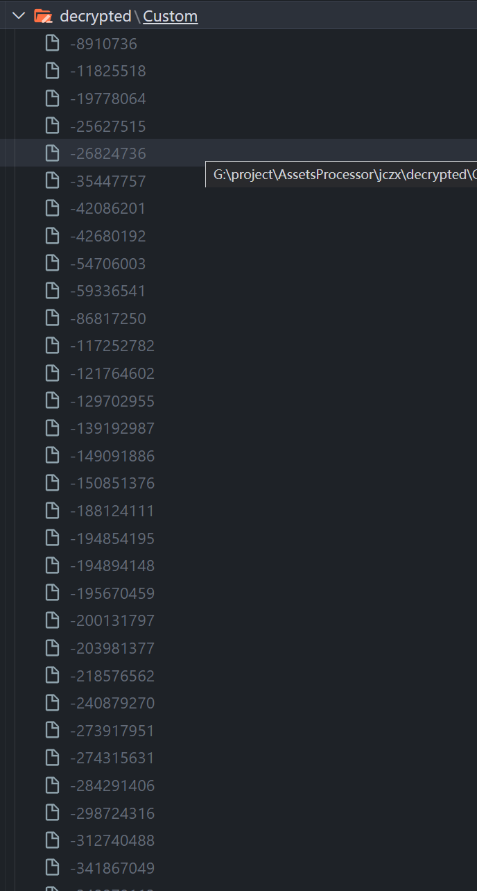
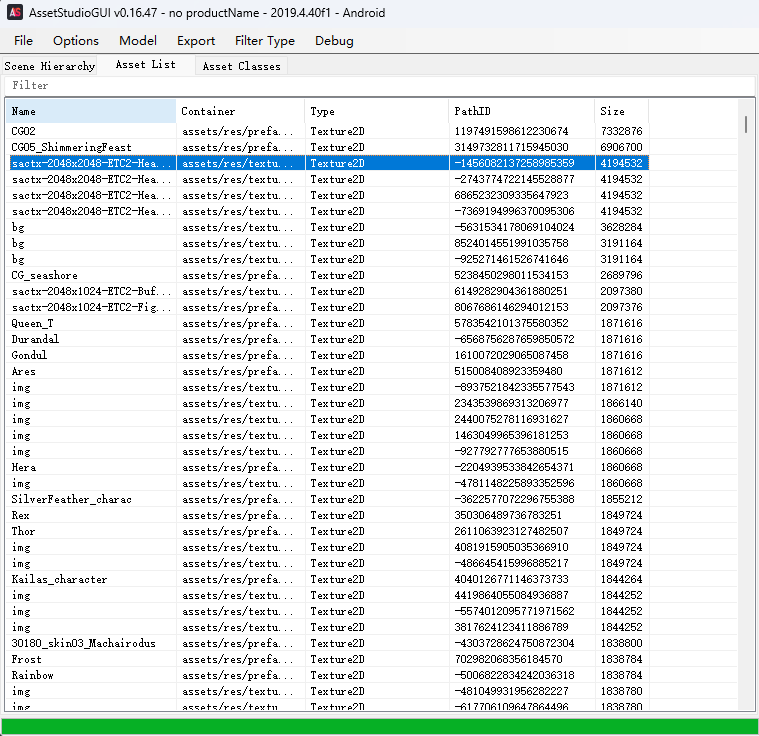

# 交错战线资源解包

## dependence

nodejs
[AssetStudio](https://github.com/Perfare/AssetStudio)

## 脚本

### decrypt.js

将同目录 /files/Custom 文件夹进行批量解密

### ~~splitPack.js~~

~~将同目录 packs 文件夹进行批量分片，packs 文件夹为 apk 直接解压后得到的.bs 文件。在初次在安卓系统打开游戏后会进行文件解压，解压目录：Android/data/com.megagame.crosscore/files~~

## 运行

1. 拷贝 Android/data/com.megagame.crosscore/files 到 jczx/
2. 在 jczx/目录执行 `node decrypt.js`
3. 解密出以下文件

   

4. AssetStudio: File -> load folder (Custom)

   

5. 导出 prefab
